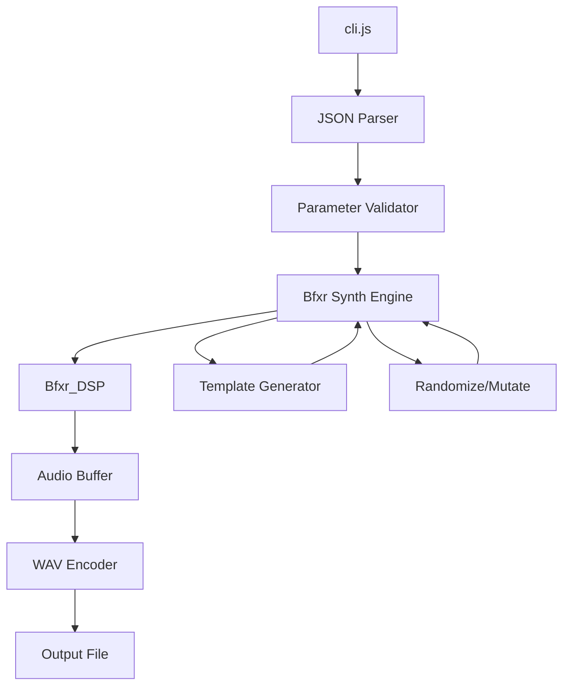

# Bfxr2 CLI Audio Generation Plan

## Project Analysis Summary

### Architecture Overview



### Core Components Identified

| Component | File | Purpose |
|-----------|------|---------|
| Bfxr | `js/synths/Bfxr.js` | Main synth class with parameters and templates |
| Bfxr_DSP | `js/audio/Bfxr_DSP.js` | Core DSP audio generation engine |
| SynthBase | `js/synths/SynthBase.js` | Base class with param handling and WAV export |
| RealizedSound | `js/audio/RealizedSound.js` | Audio buffer wrapper |
| riffwave | `js/audio/riffwave.js` | WAV file encoding |

### Key Parameters (32 total)

| Parameter | Range | Default | Description |
|-----------|-------|---------|-------------|
| waveType | 0-11 | 0 | Waveform type (Square, Saw, Sin, Noise, etc.) |
| masterVolume | 0-1 | 0.5 | Overall volume |
| attackTime | 0-1 | 0 | Volume envelope attack length |
| sustainTime | 0-1 | 0.3 | Volume envelope sustain length |
| sustainPunch | 0-1 | 0 | Sustain envelope punch |
| decayTime | 0.03-1 | 0.4 | Volume envelope decay length |
| compressionAmount | 0-1 | 0 | Dynamic compression |
| frequency_start | 0-1 | 0.3 | Base frequency |
| frequency_slide | -0.5 to 0.5 | 0 | Frequency slide |
| frequency_acceleration | -1 to 1 | 0 | Frequency acceleration |
| min_frequency_relative_to_starting_frequency | 0-0.99 | 0 | Frequency cutoff |
| vibratoDepth | 0-1 | 0 | Vibrato depth |
| vibratoSpeed | 0-1 | 0 | Vibrato speed |
| pitch_jump_repeat_speed | 0-1 | 0 | Pitch jump repeat |
| pitch_jump_amount | -1 to 1 | 0 | First pitch jump |
| pitch_jump_onset_percent | 0-1 | 0 | First pitch jump onset |
| pitch_jump_2_amount | -1 to 1 | 0 | Second pitch jump |
| pitch_jump_onset2_percent | 0-1 | 0 | Second pitch jump onset |
| overtones | 0-1 | 0 | Harmonic overtones |
| overtoneFalloff | 0-1 | 0 | Overtone decay rate |
| squareDuty | 0-0.99 | 0 | Square wave duty |
| dutySweep | -1 to 1 | 0 | Duty sweep |
| repeatSpeed | 0-1 | 0 | Note repeat speed |
| flangerOffset | -1 to 1 | 0 | Flanger offset |
| flangerSweep | -1 to 1 | 0 | Flanger sweep |
| lpFilterCutoff | 0.01-1 | 1 | Low-pass filter |
| lpFilterCutoffSweep | -1 to 1 | 0 | Low-pass sweep |
| lpFilterResonance | 0-1 | 0 | Low-pass resonance |
| hpFilterCutoff | 0-1 | 0 | High-pass filter |
| hpFilterCutoffSweep | -1 to 1 | 0 | High-pass sweep |
| bitCrush | 0-1 | 0 | Bit crush amount |
| bitCrushSweep | -1 to 1 | 0 | Bit crush sweep |

### Available Templates

| Template | Method | Description |
|----------|--------|-------------|
| pickup_coin | generate_pickup_coin | Blips and bleeps |
| laser_shoot | generate_laser_shoot | Pew pew sounds |
| explosion | generate_explosion | Boom sounds |
| powerup | generate_powerup | Power-up sounds |
| hit_hurt | generate_hit_hurt | Hit/hurt sounds |
| jump | generate_jump | Jump sounds |
| blip_select | generate_blip_select | UI blip sounds |
| randomize | randomize_params | Random parameters |
| mutate | mutate_params | Mutate current params |

## CLI Design

### Usage

```bash
node cli.js [options]
```

### Options

| Option | Type | Description |
|--------|------|-------------|
| `--params` | JSON string | Full parameter object |
| `--params-file` | File path | Path to JSON params file |
| `--template` | String | Template name (e.g., "pickup_coin") |
| `--randomize` | Flag | Generate random sound |
| `--mutate` | JSON string | Base params to mutate from |
| `--output` | File path | Output file path (default: "output.wav") |
| `--format` | String | Output format: wav, mp3, base64 (default: wav or inferred from output extension) |
| `--sample-rate` | Number | Sample rate (default: 44100) |
| `--bit-depth` | Number | Bit depth: 8, 16 (default: 16, WAV only) |
| `--bitrate` | Number | MP3 bitrate in kbps (default: 128, MP3 only) |
| `--seed` | Number | Random seed for reproducibility |
| `--count` | Number | Number of sounds to generate |
| `--verbose` | Flag | Print debug info |

### JSON Parameter Schema

```json
{
  "waveType": 0,
  "masterVolume": 0.5,
  "attackTime": 0,
  "sustainTime": 0.3,
  "sustainPunch": 0,
  "decayTime": 0.4,
  "compressionAmount": 0,
  "frequency_start": 0.3,
  "frequency_slide": 0,
  "frequency_acceleration": 0,
  "min_frequency_relative_to_starting_frequency": 0,
  "vibratoDepth": 0,
  "vibratoSpeed": 0,
  "pitch_jump_repeat_speed": 0,
  "pitch_jump_amount": 0,
  "pitch_jump_onset_percent": 0,
  "pitch_jump_2_amount": 0,
  "pitch_jump_onset2_percent": 0,
  "overtones": 0,
  "overtoneFalloff": 0,
  "squareDuty": 0,
  "dutySweep": 0,
  "repeatSpeed": 0,
  "flangerOffset": 0,
  "flangerSweep": 0,
  "lpFilterCutoff": 1,
  "lpFilterCutoffSweep": 0,
  "lpFilterResonance": 0,
  "hpFilterCutoff": 0,
  "hpFilterCutoffSweep": 0,
  "bitCrush": 0,
  "bitCrushSweep": 0
}
```

### Example Usage

```bash
# Generate a random pickup coin sound (WAV)
node cli.js --template pickup_coin --output coin.wav

# Generate with specific parameters (MP3)
node cli.js --params '{"waveType": 0, "frequency_start": 0.5, "decayTime": 0.3}' --output laser.mp3

# Generate from params file
node cli.js --params-file params.json --output explosion.wav

# Generate 5 random sounds
node cli.js --randomize --count 5 --output sound_

# Generate with seed for reproducibility
node cli.js --template explosion --seed 12345 --output boom.mp3

# Mutate from existing params
node cli.js --mutate '{"waveType": 0, "frequency_start": 0.3}' --output mutated.wav

# Output as base64 data URI
node cli.js --template pickup_coin --format base64
```

## Implementation Plan

### Step 1: Create Headless Audio Engine

Create `js/audio/headless_engine.js` that:
- Extracts Bfxr_DSP logic for Node.js environment
- Removes browser dependencies (AudioContext, etc.)
- Provides simple generate(params) -> Float32Array interface

### Step 2: Create Audio Encoders

Create `js/cli/audio_encoders.js` that:
- **WAV Encoder**: Takes Float32Array audio data, encodes to WAV format using riffwave logic
- **MP3 Encoder**: Takes Float32Array audio data, encodes to MP3 using `lamejs` library
- Both encoders return Node.js Buffer for file writing

### Step 3: Create CLI Script

Create `cli.js` that:
- Parses command line arguments
- Validates JSON parameters
- Calls headless engine to generate audio
- Encodes and writes WAV file
- Supports batch generation

### Step 4: Create Parameter Utilities

Create `js/cli/param_utils.js` that:
- Validates parameter ranges
- Normalizes parameters
- Provides template generation functions
- Handles randomize/mutate operations

### Step 5: Write Documentation

Create `CLI.md` with:
- Full usage documentation
- Parameter reference
- Examples
- Troubleshooting

## File Structure

```
bfxr2/
├── cli.js                    # Main CLI entry point
├── js/
│   ├── cli/
│   │   ├── param_utils.js    # Parameter validation and utilities
│   │   ├── template_loader.js # Template loading for CLI
│   │   └── audio_encoders.js # WAV and MP3 encoders
│   └── audio/
│       └── headless_engine.js # Node.js compatible audio engine
├── CLI.md                    # CLI documentation
└── plans/
    └── cli-audio-generation-plan.md
```

## Technical Considerations

### Browser API Dependencies

The current code uses browser APIs that need to be replaced:
- `Math.clamp` - needs polyfill
- `AudioBuffer` - replaced with Float32Array
- `lerp` function - needs to be defined

### Seeded Random

For reproducibility with `--seed`, need to implement a seeded PRNG to replace `Math.random()`.

### MP3 Encoding

- Use `lamejs` library - pure JavaScript MP3 encoder, no external dependencies
- Supports configurable bitrate (default: 128kbps, configurable via `--bitrate`)
- Alternative: `node-lame` wrapper for LAME binary (faster but requires binary download)

### Performance

- Bfxr_DSP generates audio synchronously
- For batch generation, consider async/parallel processing
- Large overtone values can cause slowdown (documented warning)

## Next Steps

1. Review and approve this plan
2. Switch to Code mode for implementation
3. Start with headless engine and WAV encoder
4. Build CLI script on top
5. Test with various parameter combinations
6. Write documentation
